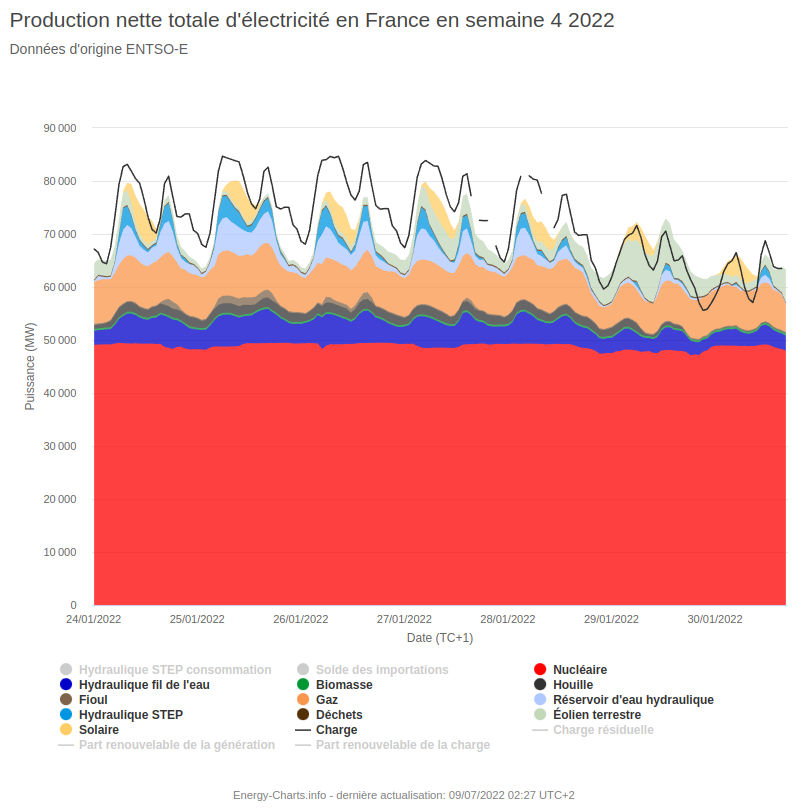

#actu

# Quand le photovoltaïque allemand produit plus que le nucléaire français

[Article Reporterre](https://reporterre.net/Quand-le-photovoltaique-allemand-produit-plus-que-le-nucleaire-francais)

## Contenu de l'article

> 

> 

> 

> 

> 
- donc en fait, il compare les 60 GW solaire/nucléaire mais c'est pas comparable du tout
- facteur de charge mais aussi intermittence (cf plus bas)

> 
- beaucoup de mauvaise foi :
	- rapport entre la production et la guerre ?
	- gestion de l'intermittence ?
	- investissement nucléaire/ENR en France ?

## Analyse de mix électriques allemands/français

Graphiques générés via le site [Fraunhofer Energy-Charts](https://www.energy-charts.info/charts/power/chart.htm).
 
### Semaine 24 en Allemagne

- La production photovoltaique est important mais très variable
- et ne réduit pas le charbon/fioul/...
- L'intermittence n'est pas complétement compensée par les steps/éolien/...
- donc nécessité du gaz/import

### Semaine 24 en France

- part du nucléaire importante et stable
- part du solaire : jusqu'à 10 GW
- production qui suit la demande, sans exportation
- ajustement par le gaz/hydraulique/import

### Semaine 4 en Allemagne

- les 2 premiers jours : pas de vent/solaire
- beaucoup de charbon/fioul/gaz et import
- grosse part solaire/éolien mais nécessité d'un backup pilotable

### Semaine 4 en France

- nucléaire toujours aussi important et stable
- ajustement par le gaz/hydraulique et import

## Conclusion

- L'article prétend démontrer que le solaire allemand est supérieur au nucléaire français.
- C'est plutôt raté : il montre surtout que l'intermittence du solaire est problématique et repose toujours sur un backup charbon/fioul/gaz/import/export important.
