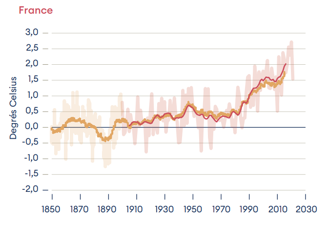
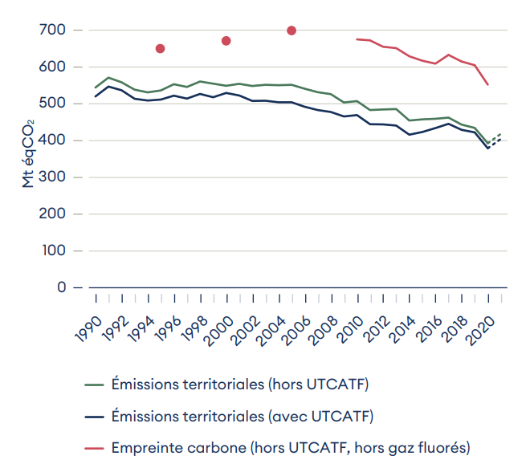
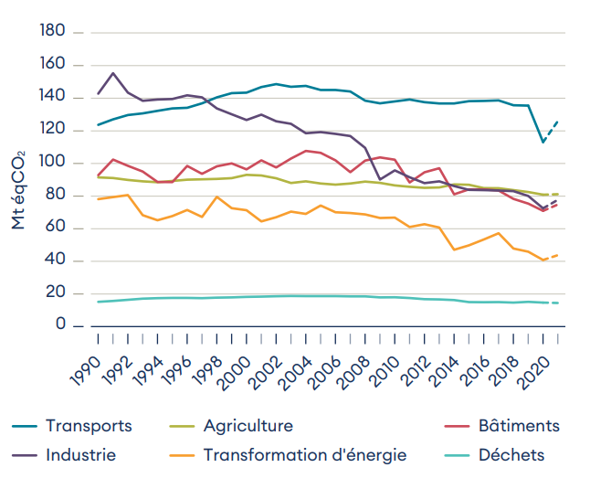

#actu

# Rapport annuel 2022 - dépasser les constats, mettre en oeuvre les solutions

![[HCC#Haut conseil pour le climat]]

## Rapport 2022

- [le rapport](https://www.hautconseilclimat.fr/publications/rapport-annuel-2022-depasser-les-constats-mettre-en-oeuvre-les-solutions/)
- [le thread twitter](https://twitter.com/hc_climat/status/1542400075409903616)

> Les impacts du changement climatique s’aggravent en France, avec des effets chroniques et aigus et des conséquences matérielles et financières déjà importantes

> les émissions GES de la France en 2021 s’inscrivent dans la poursuite d’une tendance à la baisse (-1,9%/ an sur 2019-2021) et à un rythme proche de celui observé sur la décennie

> Pour la 1ère fois cette année, tous les grands secteurs connaissent désormais une baisse de leurs émissions

> La réponse climatique de la France progresse mais reste insuffisante. Sur les 25 orientations de la SNBC:
> - 6 bénéficient de mesures au niveau requis pour l’atteinte des budgets carbone
> - 15 bénéficient de mesures présentant des risques majeurs
> - 4 ont des mesures apparaissant en déphasage

> La France n’est pas prête à faire face aux risques climatiques croissants. Les politiques d’adaptation souffrent d’un manque d’objectifs stratégiques, de moyens et de suivi.

> Recommandations générales du HCC :
> - Décliner de manière opérationnelle la planification écologique au niveau du Premier ministre
> - Renforcer les objectifs et les mesures au plan national en rapport avec les objectifs européens pour 2030
> - Accompagner la transformation vers une économie bas carbone et résiliente aux chocs externes en tenant compte des enjeux de transition juste
> - Remobiliser la diplomatie climatique française à la lumière des nouveaux enjeux géopolitiques
