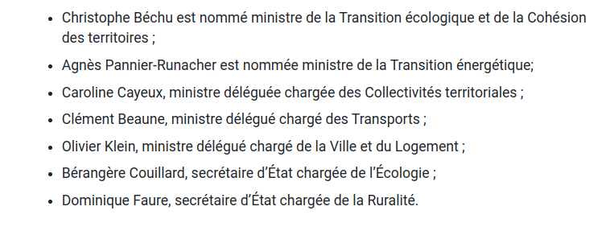
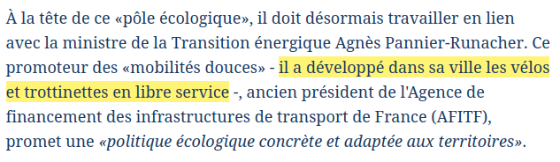

#actu 

# L'écologie dans le nouveau gouvernement

Un nouveau gouvernement (Borne 2) a été nommé le 4 juillet 2022.

## Nominations concernant l'écologie

[Passation de pouvoir d’Amélie de Montchalin à Christophe Béchu](https://www.ecologie.gouv.fr/passation-pouvoir-damelie-montchalin-christophe-bechu) 

> 

- [Christophe Béchu](https://fr.wikipedia.org/wiki/Christophe_B%C3%A9chu)
	- études en politique et en droit
	- grosse carrière politique : conseiller général, sénateur, maire...
- [Agnès Pannier-Runacher](https://fr.wikipedia.org/wiki/Agn%C3%A8s_Pannier-Runacher)
	- études à HEC, Science Po, ENA
	- haut fonctionnaire (finances, santé) + direction/administration dans le privé

## Réactions
### Media spécialisés
Pour [Actu Environnement](https://www.actu-environnement.com/ae/news/remaniement-ministeriel-nouvelle-equipe-ecologie-39945.php4)
> une nouvelle équipe gouvernementale novice en matière d'écologie

Repris par [Reporterre](https://reporterre.net/Remaniement-ministeriel-des-neophytes-a-l-ecologie) 
> des néophytes à l’écologie

### Le Figaro

[Agnès Pannier-Runacher](https://www.lefigaro.fr/politique/remaniement-agnes-pannier-runacher-une-technicienne-passee-de-l-industrie-a-la-transition-energetique-20220520)
> une technicienne passée de l'Industrie à la Transition énergétique

[Christophe Béchu](https://www.lefigaro.fr/politique/christophe-bechu-l-homme-qui-a-fait-du-macron-avant-l-heure-20190609)
> l’homme qui «a fait du Macron avant l’heure»

mais aussi un [promoteur des mobilités douces](https://www.lefigaro.fr/politique/remaniement-christophe-bechu-le-premier-des-philippistes-nomme-ministre-delegue-aux-collectivites-territoriales-20220520)
> 

### Mediapart

[Écologie : pour le nouveau gouvernement, tout reste encore à prouver](https://www.mediapart.fr/journal/france/040722/ecologie-pour-le-nouveau-gouvernement-tout-reste-encore-prouver)

> 

> 

> 

> 

> 

> 

