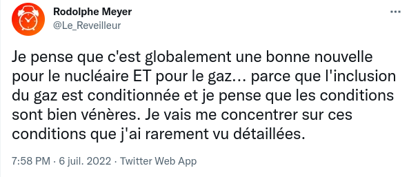
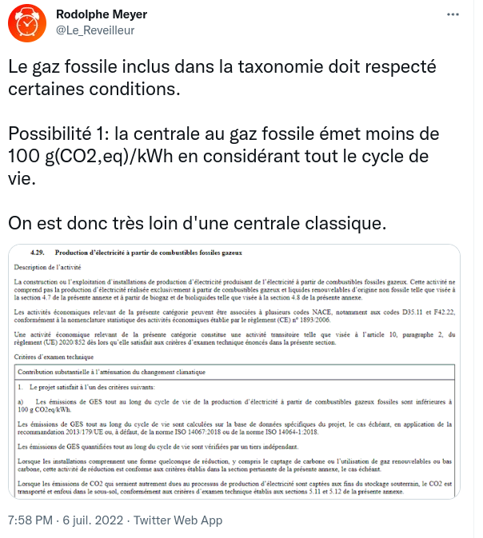
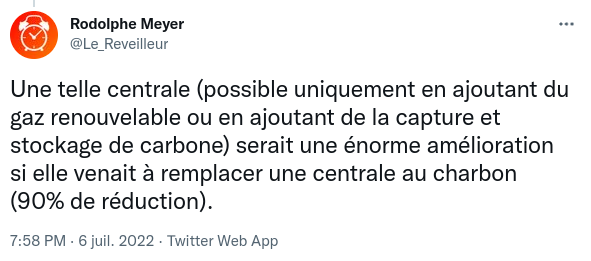
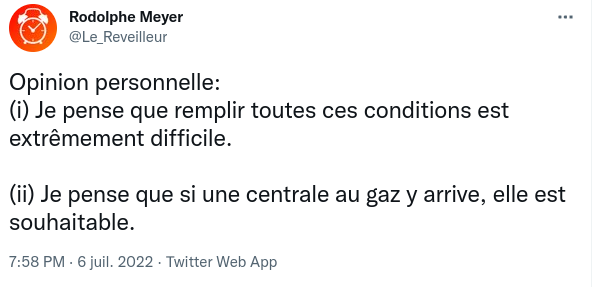
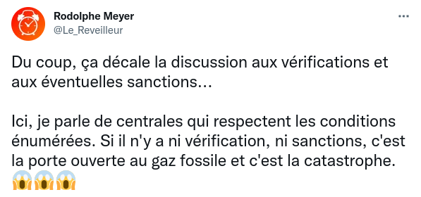
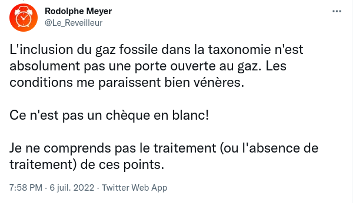

#actu

# Le gaz fossile et le nucléaire inscrit dans la taxonomie verte

Taxonomie verte : mécanisme mis en place par l'Union européenne pour définir les activités qui contribuent à la défense de l'environnement

## Selon Mediapart (et beaucoup d'autres)
[L’Europe repeint en vert le gaz fossile et le nucléaire](https://www.mediapart.fr/journal/international/060722/l-europe-repeint-en-vert-le-gaz-fossile-et-le-nucleaire)

> 

> 

suite de l'article : qui a voté quoi, réactions, recours

## Selon Rodolphe Meyer
[L'inclusion du nucléaire et du gaz dans la taxonomie verte](https://twitter.com/Le_Reveilleur/status/1544742647637721089)

> 

> 

> 

> 

> 

> 

